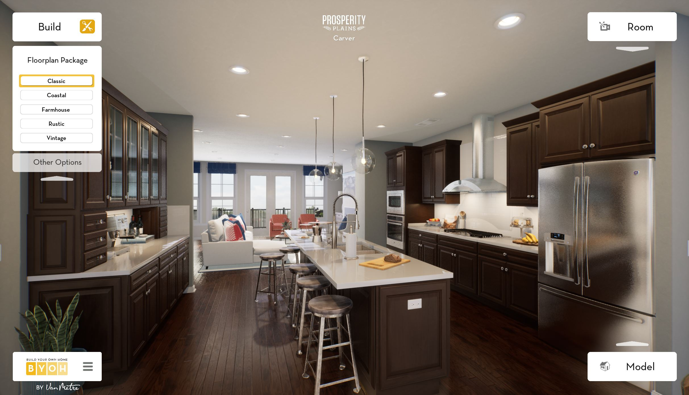
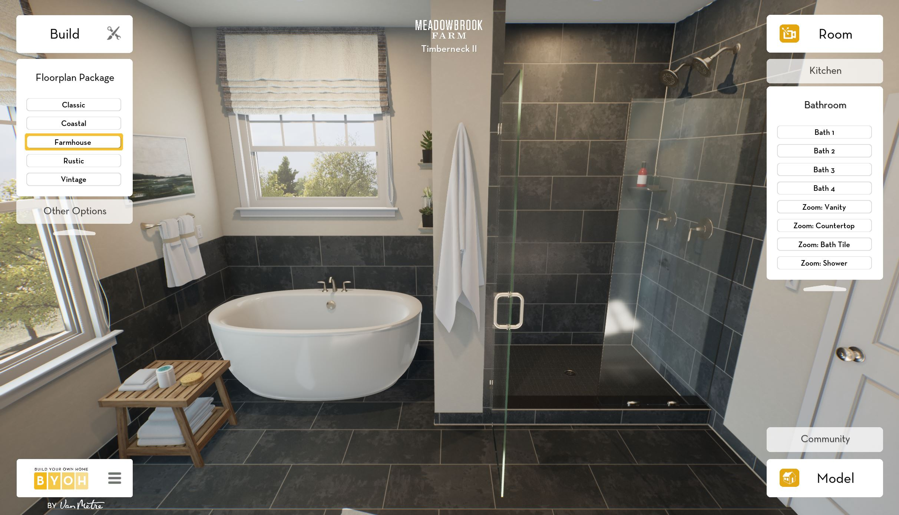
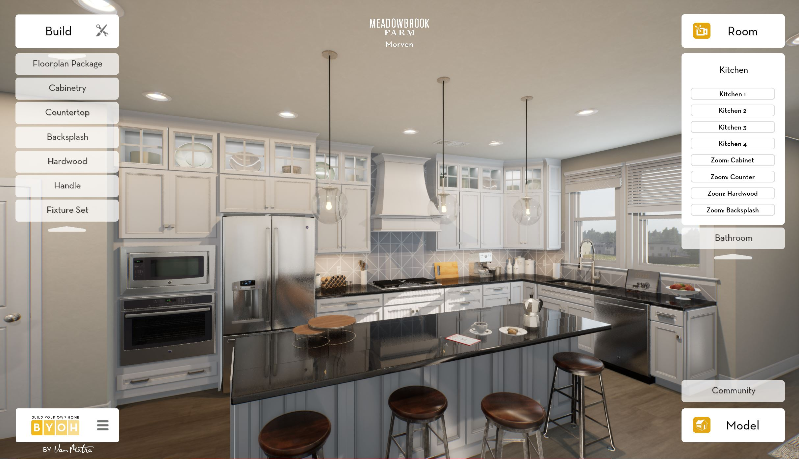

# BYOH Frontend

This repository is a sanitized code sample from a platform built in 2019-2023 for Van Metre Homes. It is included to demonstrate frontend architecture, real-time systems integration, and ownership of a complex production platform. It is not intended to represent my current preferred stack or coding conventions.

Build Your Own Home (BYOH) was an online, interactive tool that allowed home buyers to customize and visualize their home in photorealistic 3D. Unreal Engine rendered each session remotely and streamed it to the browser through Pixel Streaming/WebRTC, allowing the experience to run across desktop, mobile, and tablet without requiring high-end customer hardware. The platform received significant attention after launch and was featured by Forbes in July 2020.

I worked alongside a larger 3D team and was responsible for the overall technical implementation across the customer-facing frontend, Unreal Engine/Pixel Streaming integration, backend services, DevOps, and dynamically scaled Azure GPU infrastructure. This 2023 frontend rewrite also included contributions from other members of the development team.

[Watch a short BYOH demo](docs/BYOH.mp4)

| Carver Kitchen | Timberneck II Bath | Morven Kitchen |
| --- | --- | --- |
|  |  |  |

- Responsive customer UI for desktop, tablet, and mobile
- Data-driven floor plan, camera, material, and structural-option controls
- Unreal Engine Pixel Streaming and WebRTC session lifecycle
- Application messaging between the React client and Unreal Engine
- Login/session integration with dynamically allocated GPU instances
- Analytics and client telemetry integration

## Public-copy scope

This is a historical code sample, not the complete BYOH platform or a standalone production deployment. Production credentials, service endpoints, telemetry identifiers, licensed fonts, design-source files, product imagery, deployment configuration, and internal Git history have been removed or replaced with non-production examples.

The Unreal project, backend services, Azure orchestration, GPU host service, and signalling infrastructure were separate components of the larger system.

## Stack

- React/TypeScript
- Vite
- MobX
- CSS Modules
- Unreal Engine Pixel Streaming/WebRTC
- Node/Express
- Google Tag Manager
- LogRocket
- Docker

## Related

https://github.com/chasse20/byoh_host_service
https://www.forbes.com/sites/jennifercastenson/2020/07/28/home-sales-are-on-fire-and-being-done-like-never-before/
